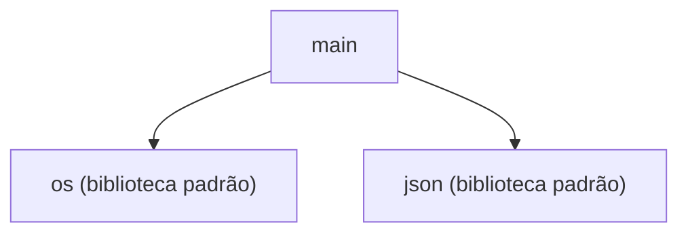

## Índice

1. [📟 Principais tecnologias utilizadas](#📟-principais-tecnologias-utilizadas)
2. [💿 Instalação e Execução](#💿-instalação-e-execução)
3. [🌎 Visão Geral](#🌎-visão-geral)
4. [💵 Principais Regras de Negócio](#💵-principais-regras-de-negócio)
5. [📐 Arquitetura e Design](#📐-arquitetura-e-design)
6. [🚀 API - Endpoints HTTP](#🚀-api---endpoints-http)
    - [📡 Endpoints Expostos pela Aplicação](#📡-endpoints-expostos-pela-aplicação)
    - [📡 cURL dos Endpoints](#📡-curl-dos-endpoints)
    - [📟 Endpoints Consumidos pela Aplicação](#📟-endpoints-consumidos-pela-aplicação)
7. [✉️ Comunicação Assíncrona (Mensageria)](#✉️-comunicação-assíncrona-(mensageria))
    - [👂 Consumers](#👂-consumers)
    - [📣 Producers](#📣-producers)
8. [🎲 Modelo de Dados da Aplicação](#🎲-modelo-de-dados-da-aplicação)
9. [🚨 Estratégia de Testes](#🚨-estratégia-de-testes)
10. [🔎 Observabilidade](#🔎-observabilidade)
    - [Logs](#logs)
    - [Métricas](#métricas)
    - [Tracing](#tracing)
11. [🚔 Segurança](#🚔-segurança)


 # 📘 make-ks-api

O projeto **make-ks-api** é uma aplicação Python estruturada como um script monolítico, concentrando toda sua lógica no arquivo principal `main.py`. Seu propósito e escopo indicam uma solução simples, ideal para automações pontuais ou prototipagem rápida. Não há evidências de funcionalidades avançadas, camadas ou frameworks robustos integrados.

## 📟 Principais tecnologias utilizadas
- Python

---

 # 💿 Instalação e Execução

## Requisitos
- Python 3 (versão exata não detectada, mas requer Python)
- Git (para clonar o repositório, se necessário)

## Instalação
> Nenhum gerenciador de dependências ou arquivo de requirements foi identificado (exemplo: requirements.txt, Pipfile, poetry.lock).  
> [Inferência] Dependências específicas não puderam ser listadas.

## Variáveis de Ambiente
> Nenhuma variável de ambiente obrigatória foi encontrada nos arquivos analisados.

## Executando Localmente
```bash
python main.py
```

## Usando Docker
> Não foram encontrados arquivos Dockerfile ou docker-compose.yml no repositório.

---

 # 🌎 Visão Geral

O sistema é um **script monolítico** desenvolvido em **Python**, cuja lógica está concentrada em um único arquivo principal (`main.py`). O projeto não apresenta divisão clássica em módulos ou camadas, nem utiliza frameworks web, controladores HTTP ou outros padrões típicos de aplicações corporativas.

Os objetivos gerais do sistema, a partir da análise das dependências e chamadas, aparentam ser:

- Manipular arquivos e diretórios no sistema operacional.
- Realizar operações de leitura e escrita de arquivos (incluindo arquivos JSON).
- Automatizar tarefas relacionadas à agregação ou organização de arquivos em formato Markdown.

## Módulos Principais

Devido à estrutura monolítica e simples do projeto, não há módulos distintos. Todas as funcionalidades estão centralizadas em `main.py`, que:

- Interage amplamente com o módulo padrão `os` do Python para operações de sistema de arquivos (criação de diretórios, leitura de arquivos, verificação de caminhos, etc.).
- Utiliza o módulo `json` para leitura e escrita de configurações ou dados estruturados.
- Não há detecção de camadas específicas como controllers, services ou repositories.
- Não há segmentação funcional detectada (como autenticação, usuários, pagamentos, etc.).

---

> **Observação:**  
A análise foi limitada pela ausência de informações específicas sobre domínio de negócio ou escopo funcional detalhado. O sistema aparenta ser uma ferramenta utilitária para manipulação e organização de arquivos locais via script Python.

 # 💵 Principais Regras de Negócio
**Lista Regras de Negócio:**

<details>
<summary>Criação e Organização de Arquivos de Saída</summary>

**Regra:** Geração Estruturada de Arquivos Markdown  
- O sistema permite ao usuário combinar arquivos de diversos diretórios, filtrando por extensões e profundidade, e gera arquivos Markdown organizados com o conteúdo ou apenas os caminhos dos arquivos.
- O diretório de saída é criado automaticamente (_kslist) no local apropriado para centralizar os resultados.
- Arquivos sensíveis (ex: `.env`, `secrets.json`) são explicitamente excluídos do processamento, prevenindo exposição acidental de dados críticos.
- **Trecho do código:**
  ```python
  def ensure_kslist_dir(parent_dir):
      kslist_dir = os.path.join(parent_dir, "_kslist")
      os.makedirs(kslist_dir, exist_ok=True)
      return kslist_dir

  def is_excluded_file(file_path):
      filename = os.path.basename(file_path)
      return filename in EXCLUDED_FILES
  ```
  [Ver linhas 11–19](main.py#L11-L19)
</details>

<details>
<summary>Validação e Exclusão de Arquivos Sensíveis</summary>

**Regra:** Proteção de Dados Sensíveis
- Antes de ler ou adicionar qualquer arquivo ao resultado, verifica-se se o arquivo está na lista de arquivos sensíveis (como `.env`, `secrets.json`).  
- Arquivos identificados como sensíveis são sempre excluídos, não importando a configuração do usuário.
- **Trecho do código:**
  ```python
  EXCLUDED_FILES = [
      'secrets.json', '.env', '.env.local', 'credentials.json', 'config.secret.json', '_kslist.md'
  ]

  def is_excluded_file(file_path):
      filename = os.path.basename(file_path)
      return filename in EXCLUDED_FILES
  ```
  [Ver linhas 8–19](main.py#L8-L19)
</details>

<details>
<summary>Validação de Diretórios e Profundidade de Busca</summary>

**Regra:** Controle de Escopo na Busca por Arquivos  
- O sistema valida se o diretório informado existe antes de qualquer operação.
- Permite configurar a profundidade máxima de busca. Se o nível for excedido, os subdiretórios adicionais não são processados.
- Diretórios padrão que não devem ser incluídos (ex: `.git`, `.venv`, `__pycache__`) são ignorados automaticamente.
- **Trecho do código:**
  ```python
  def should_ignore_dir(dir_path, ignore_dirs):
      dir_name = os.path.basename(dir_path)
      normalized_path = os.path.normpath(dir_path)
      for ignore_pattern in ignore_dirs:
          ignore_pattern = os.path.normpath(ignore_pattern)
          if dir_name == ignore_pattern or dir_name == os.path.basename(ignore_pattern):
              return True
          if ignore_pattern in normalized_path:
              return True
          if normalized_path.endswith(ignore_pattern):
              return True
      return False

  def merge_files_from_directory(...):
      ...
      if not os.path.isdir(dir_path):
          print("Diretório inválido.")
          return
      ...
      current_depth = root.rstrip(os.sep).count(os.sep) - base_depth
      if 0 < max_depth < current_depth:
          dirs[:] = []
          continue
      ...
  ```
  [Ver linhas 21–46, 56–70](main.py#L21-L46)  
</details>

<details>
<summary>Seleção Guiada e Validação de Diretório de Saída</summary>

**Regra:** Garantia de Localização Segura para Saída  
- Ao gerar arquivos a partir de uma lista, o usuário deve selecionar explicitamente o diretório de saída entre os níveis extraídos dos arquivos.  
- Se for informado um diretório inválido, o sistema solicita nova entrada até receber um caminho válido.
- **Trecho do código:**
  ```python
  def select_output_directory(file_list):
      dir_levels = extract_directory_levels(file_list)
      if not dir_levels:
          print("⚠️ Não foi possível extrair diretórios da lista de arquivos.")
          return os.getcwd()
      ...
      while True:
          try:
              choice = input("\nEscolha uma opção: ").strip()
              choice_num = int(choice)
              if 1 <= choice_num <= len(dir_levels):
                  selected_dir = dir_levels[choice_num - 1]
                  print(f"✅ Diretório selecionado: {selected_dir}")
                  return selected_dir
              elif choice_num == len(dir_levels) + 1:
                  custom_dir = input("Informe o diretório: ").strip()
                  custom_dir = normalize_path(custom_dir)
                  if os.path.isdir(custom_dir):
                      print(f"✅ Diretório selecionado: {custom_dir}")
                      return custom_dir
                  else:
                      print("❌ Diretório inválido. Tente novamente.")
              else:
                  print("❌ Opção inválida. Tente novamente.")
          except ValueError:
              print("❌ Por favor, digite um número válido.")
          except KeyboardInterrupt:
              print("\n\n❌ Operação cancelada.")
              return None
  ```
  [Ver linhas 149–186](main.py#L149-L186)
</details>

<details>
<summary>Configuração Persistente e Execução Automatizada</summary>

**Regra:** Armazenamento e Reuso Seguro de Configurações  
- Configurações utilizadas (diretório, extensões, profundidade, etc.) podem ser salvas em arquivos JSON no diretório do usuário.  
- O sistema carrega e executa configurações apenas se o arquivo existir e for válido JSON; caso contrário, aborta e exibe erro.
- **Trecho do código:**
  ```python
  CONFIG_DIR = os.path.join(os.path.expanduser("~"), ".merge_files_configs")
  os.makedirs(CONFIG_DIR, exist_ok=True)

  def save_config(config_name, config_data):
      config_path = os.path.join(CONFIG_DIR, f"{config_name}.json")
      try:
          with open(config_path, 'w', encoding='utf-8') as f:
              json.dump(config_data, f, indent=2)
          print(f"✅ Configuração '{config_name}' salva com sucesso!")
          print(f"📁 Local: {config_path}")
          return True
      except Exception as e:
          print(f"❌ Erro ao salvar configuração: {e}")
          return False

  def load_config(config_name):
      config_path = os.path.join(CONFIG_DIR, f"{config_name}.json")
      try:
          with open(config_path, 'r', encoding='utf-8') as f:
              return json.load(f)
      except FileNotFoundError:
          print(f"❌ Configuração '{config_name}' não encontrada.")
          return None
      except Exception as e:
          print(f"❌ Erro ao carregar configuração: {e}")
          return None
  ```
  [Ver linhas 187–213](main.py#L187-L213)
</details>


---

> Caso precise de mais detalhes sobre uma regra específica ou queira expandir para fluxos mais complexos, solicite detalhamento indicando a regra de interesse.

 # 📐 Arquitetura e Design

A aplicação apresenta uma arquitetura monolítica simples, baseada em um único arquivo principal (`main`). Não há evidências de divisão formal em camadas clássicas como Controller, Service ou Repository, tampouco uso de padrões arquiteturais avançados (ex: MVC, Hexagonal, Clean Architecture). Toda a lógica está centralizada no arquivo principal, que interage diretamente com módulos da biblioteca padrão do Python (`os`, `json`). 

## Camadas e Componentes Identificados

- **Principal (main)**: concentra toda a lógica da aplicação, incluindo manipulação de arquivos, diretórios e processamento de dados.
- **Dependências externas**: utiliza módulos padrão do Python (`os` para operações de sistema de arquivos e `json` para manipulação de dados JSON).

Não foram identificadas camadas distintas (Controller, Service, Repository) ou separação de responsabilidades entre arquivos. A organização é típica de scripts utilitários ou ferramentas de automação simples.

## Diagrama:



---

**Evidências e limitações:**  
- Toda a lógica está no arquivo `main`.
- Não há outros módulos ou classes com responsabilidades separadas.
- As chamadas externas são exclusivamente para módulos utilitários da linguagem.
- Não é possível identificar camadas tradicionais ou padrões arquiteturais avançados com base na estrutura analisada.

 # 🚀 API - Endpoints HTTP
## 📡 Endpoints Expostos pela Aplicação
**Lista Endpoints:**

> **Observação:**  
> A análise abaixo foi realizada a partir do arquivo `main.py`. Não foram identificados controladores, decorators ou handlers que exponham endpoints HTTP via frameworks web como Flask, FastAPI, Django, ou similares.  
> O arquivo analisado consiste em lógica de manipulação de arquivos e diretórios, sem qualquer evidência (explícita ou indireta) de rotas/serviços HTTP sendo disponibilizados.

---

### Não há endpoints HTTP expostos

- **Verificação realizada:**  
  - Não há uso de decorators típicos para exposição de endpoints (ex.: `@app.route`, `@api.get`, `@route`, etc.).
  - Não há importação de frameworks web (ex.: Flask, FastAPI, Django, Tornado, Sanic).
  - Todo o fluxo apresentado está relacionado a manipulação de arquivos e diretórios locais.

---

> **Até o momento, a aplicação analisada não expõe endpoints HTTP para entrada de dados.**  
> Caso exista outro arquivo não apresentado que implemente endpoints HTTP, forneça o conteúdo para nova análise.

---

## Resumo por Tarefa

### 1. Identificação
- **Controladores/Handlers**: Não identificados.
- **Endpoints encontrados**: Nenhum.

### 2. Documentação
- Não aplicável, pois não há endpoints expostos.

### 3. Detalhes do Processamento
- Não aplicável.

---

> Caso deseje analisar outro módulo/arquivo ou tenha dúvidas sobre integração HTTP da aplicação, envie o(s) arquivo(s) correspondente(s) para revisão.

 ## 📡 cURL dos Endpoints

**Lista de endpoints:**
> Observação: Não foram encontrados endpoints REST ou definições OpenAPI/Swagger no arquivo `main.py` da aplicação make-ks-api.  
> O arquivo analisado é um script utilitário Python focado em manipulação de arquivos e diretórios locais, sem qualquer rota HTTP, framework web (ex.: Flask, FastAPI, Django), decorators de endpoint, nem contratos de API.

### Resumo detalhado da análise

- **Escopo do código:**  
  O conteúdo do arquivo principal (`main.py`) lida exclusivamente com operações de sistema de arquivos, manipulação de listas, leitura e escrita de arquivos e diretórios, e interação via linha de comando.
- **Framework web:**  
  Não há uso de Flask, FastAPI, Django, Tornado, ou outros frameworks Python voltados para criação de endpoints REST.
- **OpenAPI/Swagger:**  
  Não foi localizado nenhum arquivo YAML/JSON nem bloco de documentação que defina endpoints ou contratos HTTP.
- **Chamadas externas:**  
  O fluxo de chamadas externas se limita a módulos internos (`os`, `json`) sem qualquer integração por HTTP.

---

### Observação

Se houver endpoints REST nesta aplicação, eles não estão presentes no código analisado (`main.py`).  
Caso exista outro arquivo implementando rotas HTTP (ex.: api.py, app.py) ou um contrato OpenAPI fora deste script, forneça esse conteúdo para que os comandos cURL possam ser gerados conforme solicitado.

---

**Nenhum comando cURL foi gerado pois não há endpoints detectados na base fornecida.**

 ## 📟 Endpoints Consumidos pela Aplicação
**Lista Endpoints:**

Nenhum endpoint HTTP externo foi identificado como consumido pela aplicação até o momento.

### Observações
- Não há chamadas a APIs externas por meio de bibliotecas como `requests`, `httpx` ou similares no arquivo analisado (`main.py`).
- Não foram localizadas URLs, domínios ou variáveis de ambiente que configurem endpoints externos.
- Toda a lógica da aplicação está concentrada em manipulação de arquivos e diretórios locais, sem interações HTTP detectadas.

---

> Se houver outros arquivos ou trechos de código relevantes para análise de endpoints consumidos, envie-os para que a documentação seja complementada.

 # ✉️ Comunicação Assíncrona (Mensageria)

A análise do fluxo de chamadas e da estrutura da aplicação make-ks-api indica que as interações externas realizadas pela aplicação estão restritas às bibliotecas padrão do Python, como `os` e `json`, sem evidências de integração com sistemas ou bibliotecas de mensageria (como Kafka, RabbitMQ, SQS, NATS, ou similares).

Não foram identificadas chamadas, imports, funções ou métodos relacionados a filas, tópicos, eventos ou qualquer mecanismo de comunicação assíncrona entre sistemas.

## 👂 Consumers
Nenhum consumidor (listener/subscriber) de mensageria identificado na aplicação.

## 📣 Producers
Nenhum produtor (publisher) de mensagens para filas, tópicos ou brokers identificado na aplicação.

---

**Observação:**  
Caso novas evidências de mecanismos de mensageria sejam apresentadas (por exemplo, uso explícito de bibliotecas como `pika`, `kafka-python`, `boto3`, etc.), esta documentação poderá ser atualizada para detalhar os fluxos assíncronos existentes.

 # 🎲 Modelo de Dados da Aplicação

## 🗄️ Banco de Dados: **Não identificado**

---

**Não foram identificadas estruturas de dados no código fornecido.**

- Não há anotações de entidades, mapeamento ORM, instruções SQL, definição de tabelas, coleções, documentos ou qualquer referência explícita a modelos de dados relacionais ou não relacionais no arquivo analisado (`main.py`).
- O código está focado em operações de manipulação de arquivos e diretórios, não apresentando qualquer estrutura relacionada a banco de dados.

---

## 🌳 Representação em Árvore

```
[Nenhuma tabela ou entidade identificada]
```

---

## Exemplo de Relacionamento

[Nenhum relacionamento encontrado, pois não há tabelas ou entidades.]

---

> Caso seja necessário analisar outro arquivo ou caso existam módulos adicionais na aplicação relacionados ao modelo de dados, por favor, forneça-os para uma análise mais aprofundada.

 # 🚨 Estratégia de Testes

Com base na estrutura do repositório e na análise do arquivo principal (`main.py`), **não foram identificadas estruturas, arquivos ou pastas dedicadas a testes** (como `test`, `tests`, `__tests__`, ou arquivos com sufixos `*Test`, `*Spec`). Também não há comentários, funções ou blocos no código principal relacionados a testes automatizados, mocks ou validação formal.

Aparentemente, **não há uma estratégia de testes implementada na aplicação**. Isto é comum em scripts utilitários ou protótipos de pequena escala, mas pode ser considerado uma lacuna relevante para manutenção e evolução do código.

## Frameworks Utilizados

- Nenhum framework de testes foi identificado no código-fonte inspecionado.
- Não há referências a PyTest, unittest, nose, doctest, ou qualquer outra biblioteca de testes Python.
- Não há arquivos de configuração que indiquem integração com ferramentas externas de teste.

## Estrutura dos Testes

- Nenhuma pasta ou arquivo dedicado a testes foi encontrada.
- Nenhum exemplo de função ou classe de teste foi localizado.
- Não existem comandos, scripts ou instruções para execução de testes.

## Executando os Testes

Nenhum comando específico para execução de testes está documentado ou presente no repositório.

## Relatórios de Cobertura

Nenhum relatório de cobertura foi identificado no repositório da aplicação.

## Lacunas Identificadas

- **Ausência total de testes automatizados**: Não há testes unitários, de integração, contrato ou end-to-end registrados.
- **Falta de ferramentas automatizadas**: Não existe configuração para frameworks como PyTest, unittest, Coverage.py ou similares.
- **Inexistência de documentação sobre testes**: Não há README, comentários ou outros arquivos mencionando estratégias, comandos ou resultados de testes.
- **Não há relatórios de cobertura ou verificação de qualidade**.

> [!NOTE]
> Recomenda-se fortemente a inclusão de testes unitários e, se aplicável, testes de integração para aumentar a confiabilidade e facilitar a evolução do código, mesmo em projetos pequenos.

---

 # 🔎 Observabilidade
A aplicação implementa os seguintes mecanismos de observabilidade:

## Logs
- Ferramenta(s) utilizada(s): **Não foram identificadas bibliotecas ou frameworks de logging explícitos** (como logging, Loguru, logzero, etc.).
- Formato: Não estruturado (nenhum mecanismo de formatação ou estruturação de logs foi detectado).
- Integração com sistemas externos: Não identificado.
- Configurações de nível de log: Não identificado.
- Exemplos de campos de log: Não aplicável.

## Métricas
- Ferramenta(s) utilizada(s): Não identificado nenhum sistema ou biblioteca de métricas (ex: Prometheus, statsd, OpenTelemetry Metrics).
- Endpoint de exposição: Não identificado.
- Exemplos de métricas detectadas: Nenhuma métrica personalizada ou padrão encontrada.
- Integração com sistemas externos: Não identificado.

## Tracing
- Ferramenta(s) utilizada(s): Nenhuma biblioteca ou sistema de tracing (ex: OpenTelemetry, Jaeger, Zipkin) foi detectado no fluxo analisado.
- Integração com sistemas externos: Não identificado.
- Configuração de amostragem: Não aplicável.
- Exemplos de integração: Não detectado middleware ou interceptors relacionados a tracing.

---

**Resumo:**  
Não foram encontrados mecanismos explícitos de observabilidade (logs, métricas ou tracing) na aplicação analisada. O fluxo de chamadas indica uso apenas das bibliotecas padrão `os` e `json`, sem integração com ferramentas externas de monitoramento, logging ou tracing.

 # 🚔 Segurança

A análise do repositório, baseada exclusivamente nos fluxos de chamadas e evidências presentes no código do arquivo `main.py`, revela os seguintes aspectos relativos à segurança:

## Autenticação
- **Não foram encontrados mecanismos explícitos de autenticação.**
    - Não há uso de tokens (JWT, OAuth2, API Key), sessões, ou outras formas de controle de identidade.
    - Nenhuma função, classe, middleware ou decorator relacionado a autenticação foi identificado.

## Autorização
- **Não foram encontrados mecanismos explícitos de autorização.**
    - Não há controle de acesso por perfis, roles ou permissões.
    - Não existem anotações, decorators ou validações para restringir operações a determinados usuários.

## Configurações adicionais
- **CORS:** Não há configuração relacionada a Cross-Origin Resource Sharing.
- **CSRF:** Não foi encontrada nenhuma proteção contra Cross-Site Request Forgery.
- **Rate limiting:** Não existe mecanismo para limitar o número de requisições.
- **Validação de entrada:** Não há evidências de validação específica de dados de entrada com foco em segurança.

> [!WARNING]
> - Ausência de autenticação ou autorização explícita.
> - Configurações de segurança padrão ou não customizadas.
> - Indicação de potencial vulnerabilidade: não há proteção nos fluxos mapeados, tornando os endpoints (caso existam) desprotegidos quanto ao acesso e manipulação indevida.

---